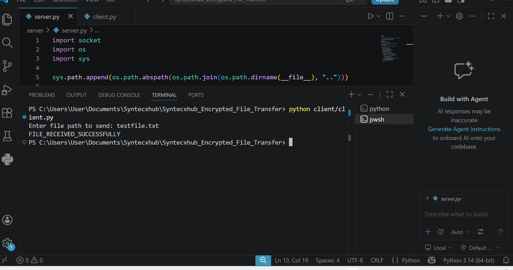
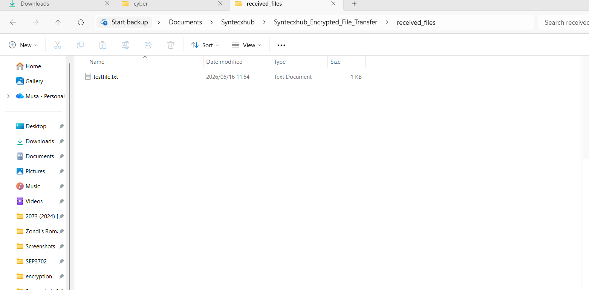

# 🔐 Syntecxhub Encrypted File Transfer

## 📌 Project Overview

Syntecxhub Encrypted File Transfer is a cybersecurity-focused Python project designed to demonstrate secure file transmission using:

- AES-256 encryption
- HMAC-SHA256 integrity verification
- TCP socket communication
- Secure client-server architecture

The project simulates how organizations securely transfer sensitive files across a network while ensuring:
- confidentiality
- integrity
- secure storage

This project was developed as part of a practical cybersecurity portfolio focused on secure communications and defensive security engineering.

---

# 🚀 Features

## ✅ AES-256 File Encryption
- Encrypts files before transmission
- Uses AES encryption in CBC mode
- Random IV generation for improved security

## ✅ HMAC Integrity Verification
- Uses HMAC-SHA256 hashing
- Detects file tampering or modification
- Verifies integrity before decryption

## ✅ Secure Client-Server Communication
- TCP socket-based secure transmission
- Simulates encrypted enterprise file transfer workflows

## ✅ Secure File Storage
- Automatically decrypts and stores validated files
- Files saved securely inside `received_files`

---

# 🛠 Technologies Used

| Technology | Purpose |
|---|---|
| Python 3 | Application development |
| Socket Programming | Client-server communication |
| AES Encryption | Data confidentiality |
| HMAC-SHA256 | Integrity verification |
| Cryptography Library | Secure encryption implementation |
| TCP/IP Networking | Secure data transmission |

---

# 📂 Project Structure

```text
Syntecxhub_Encrypted_File_Transfer
│
├── client
│   └── client.py
│
├── server
│   └── server.py
│
├── encryption
│   ├── aes_utils.py
│   └── hmac_utils.py
│
├── received_files
├── screenshots
│
├── testfile.txt
├── requirements.txt
├── README.md
├── LICENSE
└── .gitignore
```

---

# ⚙️ Installation

## 1️⃣ Clone Repository

```bash
git clone https://github.com/musechuene-commits/Syntecxhub_Encrypted_File_Transfer.git
```

## 2️⃣ Navigate Into Project

```bash
cd Syntecxhub_Encrypted_File_Transfer
```

## 3️⃣ Install Dependencies

```bash
pip install -r requirements.txt
```

---

# ▶️ Usage

## Step 1 — Start Server

```bash
python server/server.py
```

Expected output:

```text
[SERVER STARTED] Listening on 127.0.0.1:5000
```

---

## Step 2 — Start Client

Open a second terminal:

```bash
python client/client.py
```

When prompted:

```text
Enter file path to send:
```

Example:

```text
testfile.txt
```

---

# ✅ Example Output

## Client Output

```text
FILE_RECEIVED_SUCCESSFULLY
```

## Server Output

```text
[SUCCESS] File received and verified: testfile.txt
```

---

# 🔍 How The Project Works

## Step 1 — File Selection
The client selects a local file to transfer.

## Step 2 — Encryption
The file contents are encrypted using AES-256 encryption.

## Step 3 — HMAC Generation
An HMAC-SHA256 hash is generated to ensure integrity validation.

## Step 4 — Secure Transmission
The encrypted file and integrity hash are sent to the server through TCP sockets.

## Step 5 — Integrity Validation
The server validates the HMAC before decryption.

## Step 6 — File Decryption
If verification succeeds, the file is decrypted securely.

## Step 7 — Secure Storage
The file is stored inside the `received_files` directory.

---

# 📸 Screenshots

## 🔹 Server Running



---

## 🔹 Client File Transfer


---

## 🔹 Secure File Storage



---

# 🛡 Security Concepts Demonstrated

- AES Encryption
- HMAC Integrity Validation
- Secure File Transmission
- Client-Server Security Architecture
- TCP Socket Programming
- Secure Storage Principles
- Defensive Programming

---

# ⚠️ Security Limitations

This project was developed for educational purposes and does not yet include:

- TLS/SSL encryption
- Authentication mechanisms
- Secure key exchange
- Multi-user authorization
- Secure credential storage

---

# 🚀 Future Improvements

Planned future enhancements include:

- TLS/SSL secure sockets
- Multi-client support
- Secure login authentication
- File size restrictions
- Logging and monitoring
- GUI interface
- Secure key management
- Cloud storage integration

---

# 📚 Skills Demonstrated

## Cybersecurity Skills
- Cryptography implementation
- Integrity verification
- Secure communications
- Secure software development
- Defensive security engineering

## Technical Skills
- Python programming
- Networking fundamentals
- Socket programming
- File handling
- Troubleshooting

---

# 🎯 Key Learning Outcomes

Through this project I gained practical experience with:

- implementing AES encryption
- verifying data integrity using HMAC
- building secure client-server applications
- handling encrypted file transmission
- secure file storage concepts
- Python socket programming

---

# ⚖️ Disclaimer

This project was created strictly for educational and portfolio purposes in a controlled local environment.

---

# 👨‍💻 Author

## Musa Chuene

- LinkedIn: https://linkedin.com/in/musa-chuene-57a4461a8
- GitHub: https://github.com/musechuene-commits